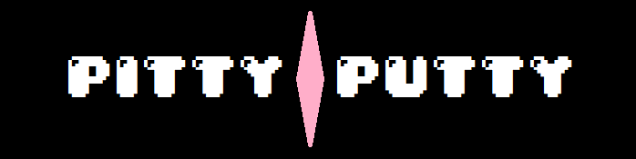

Pitty-Putty is a small demonstration game for [bägla](https://github.com/ekaktusz/bagla-engine). It aims to be a very simple and barebones Jazz Jack Rabbit clone. Consider it as a learning project.
